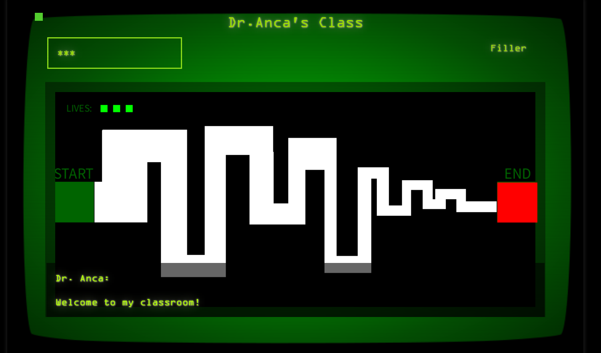

# Anca's Classroom

## Project description

A text-based horror game based on Dr. Anca (with permisison) using html, css, p5, processing, and javascript

## Team members

Ciera Baucham (@QueenCee48), Julissa Valdez-Ramos (@jvalram), ...

## Challenges that you faced
The time constraint meant our project stayed unfinished but we got pretty far

## What did you learn?
Time management, HTML, processing, image editing

# How to install

Steps:
1. one
2. two

# How to run

Steps:
1. one
2. two
